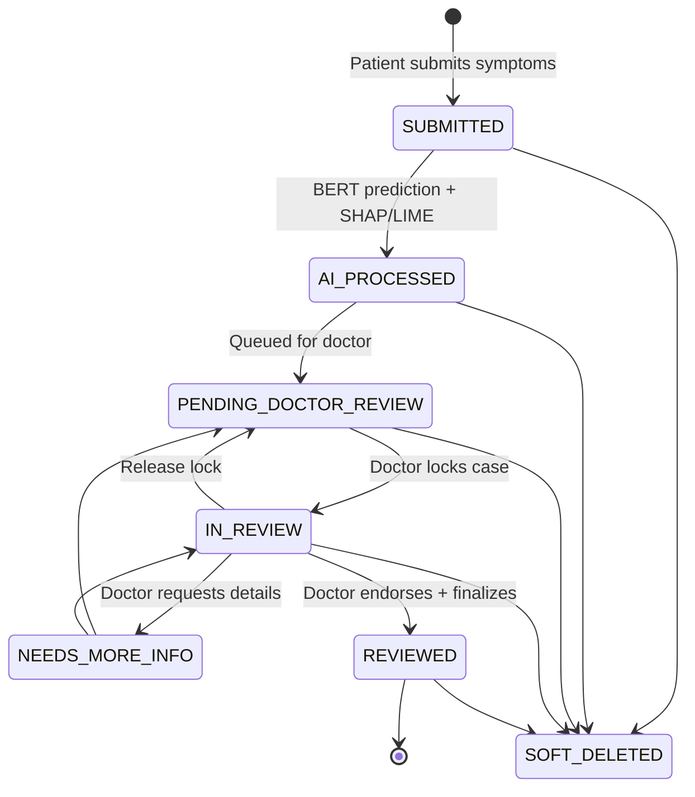
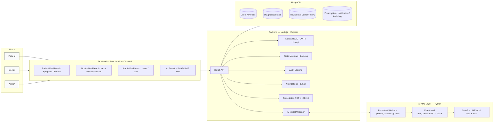
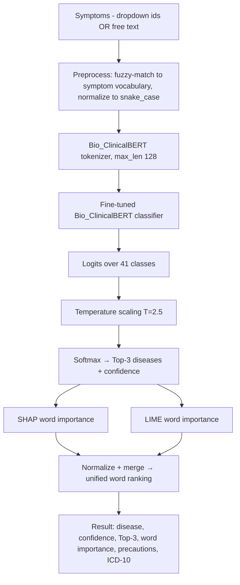
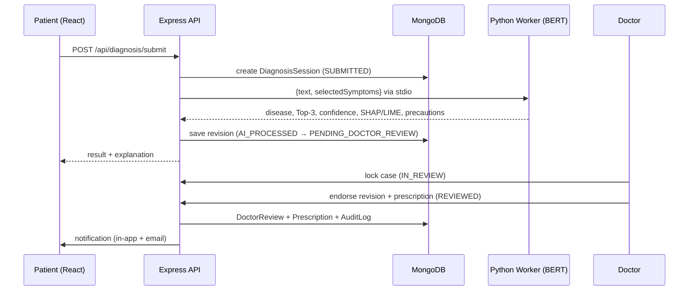

# MediDiagnose — Presentation Brief for Kimi

> **Instructions to Kimi:** Build a graduation-project presentation (PowerPoint/Google Slides
> style) from this brief. Follow the agenda exactly, one section = one or more slides. For every
> slide marked **[DIAGRAM]**, generate the described visual (Mermaid code is provided where useful —
> render it as a clean diagram). Where a figure **already exists** in the repo, prefer reusing that
> image (paths are listed in §"Existing assets"). Keep a clean medical/clinical aesthetic: white
> background, blue/teal accent (#2563eb / #14b8a6), Inter or Arial font. **Do not invent metrics or
> features** — every number and feature below is taken directly from the codebase.

---

## 0. Project facts (ground truth — use these verbatim)

| Item | Value |
|---|---|
| **Project name** | MediDiagnose — AI Medical Diagnosis System |
| **Type** | Graduation project (full-stack + AI), MSA University |
| **Authors** | Youssef Waleed & Ali Mohamed Hassanein |
| **One-liner** | A full-stack web platform where patients submit symptoms, a fine-tuned clinical BERT model predicts the most likely disease with explainable-AI evidence, and a licensed doctor reviews/endorses the result before it is finalized. |
| **Frontend** | React 18, Vite, React Router, Tailwind CSS, Axios, React Hot Toast |
| **Backend** | Node.js, Express, MongoDB + Mongoose, JWT auth, bcrypt, Helmet, Joi, rate limiting, CORS |
| **AI / ML layer** | Python — PyTorch, Hugging Face Transformers, SHAP, LIME |
| **Base model** | `emilyalsentzer/Bio_ClinicalBERT` (clinical BERT) fine-tuned for sequence classification |
| **Task** | Free-text / structured symptoms → disease classification (Top-3 returned) |
| **# disease classes** | 41 |
| **Primary dataset** | `DiseaseAndSymptoms.csv` — 4,920 rows, 41 diseases, up to 17 symptom columns/row |
| **Supporting data** | `Disease precaution.csv` (per-disease advice), `Disease_symptom_and_patient_profile_dataset.csv` (demographic profile data), `backend/data/icd10_mapping.json` (disease → ICD-10 code) |
| **Train protocol** | 80/10/10 row-level stratified split; AdamW, lr 2e-5, batch 16, 10 epochs, weight decay 0.01, warmup 0.1, early stopping (patience 2) on val loss; max seq len 128 |
| **Augmentation** | Train split only — 6 natural-language templates + symptom shuffling (e.g. "I have …", "patient reports …") to mimic real free-text narratives |
| **Calibration** | Temperature scaling (T = 2.5) to soften saturated logits into realistic confidence spread |
| **Explainability** | SHAP + LIME computed per prediction, merged into a single normalized word-importance ranking |
| **Serving** | Persistent Python worker (`predict_disease.py --serve`) loaded once, talks to Node via stdio JSON — avoids re-loading the ~400 MB model per request |

### Headline results (held-out test set, 492 samples — from `evaluation_results.json`)

| Metric | Score |
|---|---|
| Top-1 accuracy | **81.4%** |
| Top-3 accuracy | **93.7%** |
| Macro F1 | **0.796** |
| Weighted F1 | **0.812** |
| Mean confidence — correct predictions | 0.873 |
| Mean confidence — incorrect predictions | 0.531 |

> The ~0.34 confidence gap between correct and incorrect predictions is a key trust signal — the
> model is meaningfully less confident when it is wrong. Use this in Results.

---

## Agenda → Slide map

### 1. Introduction, Motivation & Objectives  (2–3 slides)
- **Title slide:** project name, subtitle "AI-assisted, explainable, doctor-in-the-loop diagnosis", authors, MSA logo (`MSA-New-Logo-Small-V (1).png`).
- **Motivation:** patients self-diagnose with unreliable web searches; clinicians face heavy triage load; black-box AI is not trusted in medicine. We need an AI that is (a) accessible, (b) explainable, (c) supervised by a human doctor.
- **Objectives (bullet list):**
  1. Build a full-stack platform usable by patients, doctors, and admins.
  2. Fine-tune a clinical language model to predict disease from symptom text.
  3. Make every prediction explainable (SHAP + LIME word importance).
  4. Keep a human doctor in the loop — AI suggests, doctor decides.
  5. Provide a complete audited clinical workflow (review, revisions, prescription, notifications).

### 2. Problem Statement & Relevance to SDGs  (1–2 slides)
- **Problem statement:** Symptom-to-diagnosis is hard for non-experts; existing symptom checkers are opaque and unaccountable; there is no audit trail or clinician oversight.
- **[DIAGRAM] SDG mapping** — show SDG badges with one line each:
  - **SDG 3 — Good Health & Well-being** (primary): improves access to early, informed triage.
  - **SDG 9 — Industry, Innovation & Infrastructure:** applies modern NLP/XAI to healthcare.
  - **SDG 10 — Reduced Inequalities:** lowers cost/access barriers to first-line health guidance.
  - **SDG 4 — Quality Education:** explainability makes it a learning tool for students/patients.
  - *(SDG 3 is the headline; render its logo largest.)*

### 3. Related Work & Justification  (1–2 slides)
- **[DIAGRAM] comparison table** — approaches vs. our choice:

  | Approach | Pros | Cons | Our verdict |
  |---|---|---|---|
  | Rule-based / keyword symptom checkers | Simple, transparent | Brittle, no NL understanding | Rejected |
  | Classic ML (TF-IDF + SVM / RandomForest) | Fast, light | Weak on free text, no context | Baseline only |
  | General BERT (bert-base) | Strong NLU | Not domain-tuned | Improvable |
  | **Bio_ClinicalBERT (fine-tuned) + SHAP/LIME** | Clinical-domain pretraining, contextual, **explainable** | Heavier, needs GPU ideally | **Chosen** |
- **Justification:** Bio_ClinicalBERT is pretrained on clinical notes (MIMIC-III), so it already understands medical language; fine-tuning on the symptom→disease dataset adapts it to the task; SHAP+LIME add the transparency that pure accuracy can't provide and that medicine demands.

### 4. Proposed Solution  (4–5 slides — this is the core)

#### 4a. Updated System Design  **[DIAGRAM — Mermaid state diagram]**
The diagnosis lifecycle is a strict state machine with pessimistic locking and append-only AI revisions.

Caption points: pessimistic locking (`lockedBy` / `lockedUntil`) prevents two doctors editing the
same case; AI outputs are stored as append-only **revisions**; a **DoctorReview** endorses a
specific revision; every transition is written to an immutable **AuditLog**.

#### 4b. Architecture  **[DIAGRAM — 5-tier; reuse generated PNG if available]**
A pre-rendered architecture PNG exists (generated by `_build_arch_diagram.py` →
`MediDiagnose_Architecture_Current.png`). Reuse it. If regenerating, use this Mermaid:

Tech-logo strip to include per tier: React, Vite, Tailwind (frontend); Node, Express, MongoDB
(backend/db); Python, PyTorch, Hugging Face (AI). Logos are in `_logos/`.

#### 4c. Dataset Details  **[DIAGRAM — reuse existing figures]**
- Primary: `DiseaseAndSymptoms.csv` — 4,920 rows, 41 diseases, up to 17 symptoms/row (snake_case ids).
- Precautions: `Disease precaution.csv` — up to 4 precautions per disease (shown to the patient).
- ICD-10 mapping: each predicted disease maps to a standard ICD-10 code for clinical interoperability.
- Split visualization: 80% train / 10% val / 10% test (492 test rows), stratified.
- Reuse figures: `notebooks/fig_dataset_overview.png`, `notebooks/fig_top_symptoms.png`,
  `notebooks/fig_symptoms_per_disease.png`, `notebooks/fig_cooccurrence.png`,
  `documentations/figures/presentation/fig_dataset_split.png`.

#### 4d. Algorithm Explanation  **[DIAGRAM — Mermaid pipeline]**

Talking points: clinical-domain pretraining → task fine-tuning; template augmentation teaches it to
read natural sentences not just comma lists; temperature scaling fixes over-confident logits;
SHAP+LIME agreement gives a robust, human-readable explanation.

### 5. Project Demonstration  (3–4 slides)
- **Frontend features** (screenshots / mockups): Symptom Checker (dropdown + free-text, severity,
  duration), Patient Dashboard & History, Doctor Dashboard (queue, lock, review, finalize, prescribe),
  Admin Dashboard (manage users, role-based access, stats), in-app notifications. Pages live in
  `frontend/src/pages/` (Landing, Login/Register, SymptomChecker, PatientDashboard, DoctorDashboard,
  DoctorPatients, AdminDashboard, ManageUsers, DiagnosisHistory, profiles).
- **Backend processes** **[DIAGRAM — Mermaid sequence]**:

- **Dataset integration & sample outputs** (reuse SHAP/LIME figures): show 3 worked examples —
  `documentations/figures/fig_malaria_shap_lime_combined.png`,
  `fig_diabetes_shap_lime_combined.png`, `fig_fungal_infection_shap_lime_combined.png`.
  Also `notebooks/fig_explainability_demo.png`. Each shows which words drove the prediction.

### 6. Results & Analysis  (2–3 slides)
- **Metrics table** (use §0 numbers) — reuse `documentations/figures/presentation/fig_table2_performance.png`.
- **Training curves** — `notebooks/fig_training_curves.png`.
- **Confusion matrix** — `notebooks/fig_confusion_matrix.png`.
- **Per-class metrics** — `notebooks/fig_per_class_metrics.png`.
- **Confidence gap analysis** (correct 0.873 vs incorrect 0.531) — `fig_confidence_gap.png`.
- **Latency / model comparison / physician trust** (if used) —
  `fig_system_latency.png`, `fig_model_comparison.png`, `fig_physician_trust.png`.
- Analysis narrative: 93.7% Top-3 means the correct disease is almost always in the shortlist a
  doctor reviews; the confidence gap supports safe human-in-the-loop deferral.

### 7. Challenges Faced & Mitigation  (1 slide — table)

| Challenge | Mitigation (implemented) |
|---|---|
| Saturated/over-confident softmax on near-deterministic data | Temperature scaling (T=2.5) for calibrated confidence |
| Users type free text, model trained on symptom ids | Fuzzy symptom-matching preprocessor + 6 augmentation templates |
| Model load cost (~400 MB) per request was slow | Persistent Python worker loaded once, stdio JSON protocol |
| Two doctors editing the same case | Pessimistic locking (`lockedBy` / `lockedUntil`) |
| Trust / black-box concern | SHAP + LIME explanations + doctor-in-the-loop endorsement |
| Class imbalance across 41 diseases | Stratified split + macro-F1 reporting (not just accuracy) |
| Auditability for medical decisions | Immutable AuditLog on every state transition + append-only revisions |

### 8. References  (1 slide)
- Alsentzer et al., *Publicly Available Clinical BERT Embeddings* (Bio_ClinicalBERT), 2019.
- Devlin et al., *BERT: Pre-training of Deep Bidirectional Transformers*, 2019.
- Lundberg & Lee, *A Unified Approach to Interpreting Model Predictions* (SHAP), NeurIPS 2017.
- Ribeiro et al., *"Why Should I Trust You?": Explaining the Predictions of Any Classifier* (LIME), KDD 2016.
- Hugging Face Transformers — https://huggingface.co/docs/transformers
- SHAP docs — https://shap.readthedocs.io ; LIME — https://github.com/marcotcr/lime
- Dataset: Kaggle "Disease Symptom Prediction" (DiseaseAndSymptoms.csv + precautions).
- UN Sustainable Development Goals — https://sdgs.un.org/goals

---

## Existing assets (prefer reusing these images)

**`notebooks/`** — `fig_dataset_overview.png`, `fig_top_symptoms.png`, `fig_symptoms_per_disease.png`,
`fig_cooccurrence.png`, `fig_training_curves.png`, `fig_confusion_matrix.png`,
`fig_per_class_metrics.png`, `fig_explainability_demo.png`

**`documentations/figures/`** — SHAP/LIME/combined for `diabetes`, `fungal_infection`, `malaria`
(e.g. `fig_malaria_shap_lime_combined.png`)

**`documentations/figures/presentation/`** — `fig_table2_performance.png`, `fig_training_curves.png`,
`fig_dataset_split.png`, `fig_confidence_gap.png`, `fig_model_comparison.png`,
`fig_system_latency.png`, `fig_physician_trust.png`, `fig_xai_gallery.png`, `fig_summary_slide.png`

**Architecture** — `MediDiagnose_Architecture_Current.png` (from `_build_arch_diagram.py`)

**Branding** — `MSA-New-Logo-Small-V (1).png`; tech logos in `_logos/`

## Suggested slide count
~16–20 slides total. Keep one idea per slide, large diagrams, minimal text. Use the blue/teal
clinical palette and the MSA logo on the title + closing slides.
